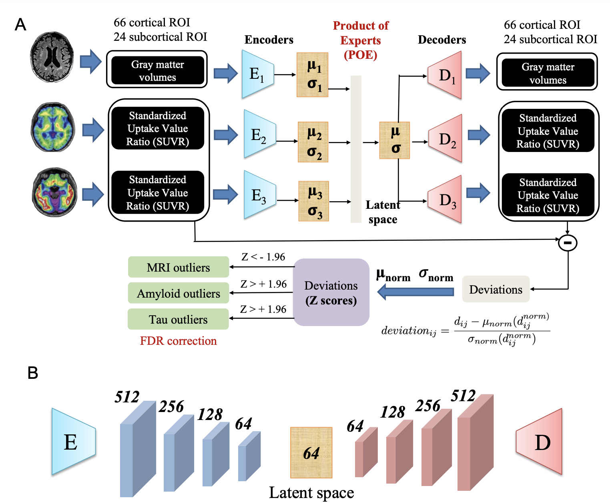

# Overview
This repository contains the implementation for our paper titled "Analysing heterogeneity in Alzheimer Disease using multimodal normative modelling on ATN biomarkers", [[BiorXiv](https://www.ncbi.nlm.nih.gov/pmc/articles/PMC10473626/)] 

 

Figure 1: Our proposed multimodal normative modeling framework (mmVAE).

## Acknowledgement

This work was supported by the Centene Corporation contract (P19-00559) for the Washington University-Centene ARCH Personalized Medicine Initiative and
the National Institutes of Health (NIH) (R01-AG067103). 
  
## Citation
If you find our work is useful in your research, please consider raising a star  :star:  and citing:

```
@article{kumara2024analysing,
  title={Analysing heterogeneity in Alzheimer Disease using multimodal normative modelling on ATN biomarkers},
  author={Kumara, Sayantan and Earnest, Thomas and Yang, Braden and Kothapalli, Deydeep and Benzinger, Tammie LS and Gordon, Brian A and Payne, Philip and Sotiras, Aristeidis},
  journal={arXiv preprint arXiv:2404.05748},
  year={2024}
}
